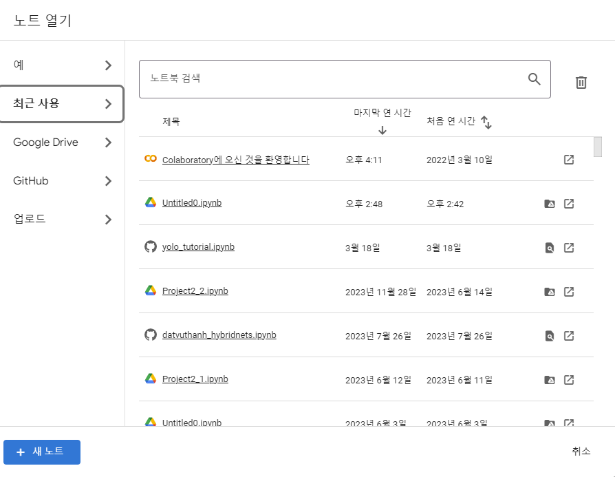
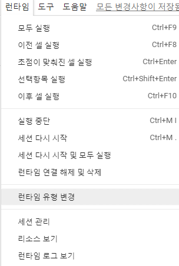
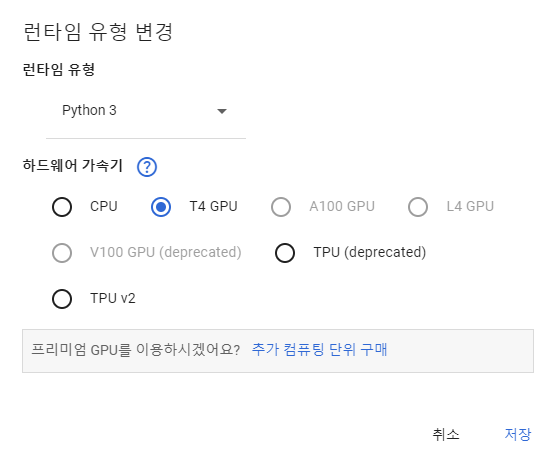
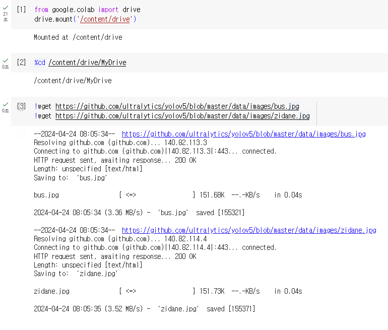

# YOLOv5 Object Detection 실습

### Google Colab을 통해서 진행할 예정
1. Colab으로 접속
    ```
    https://colab.research.google.com/
    ```

2. 시작 전 기본 설정

    아래의 사진을 참고해서 위의 주소로 접속하고 새 노트를 만든다.

    
    
    아래의 왼쪽 사진처럼 *런타임 유형 변경*을 눌러, 오른쪽 사진과 같이 GPU로 설정하고 저장한다.

     

3. Command 설명

    ```
    Ctrl(Command) + Enter : 해당 셀 실행
    Shift + Enter : 해당 셀 실행 + 커서를 다음 셀로 이동
    Alt(Command) + Enter : 해당 셀 실행 + 코드 블록 하단에 추가
    ```
    좌상단에 `+코드` 라는 걸 눌러서도 직접 셀을 추가 할 수 있음

    `%cd` : 위치 이동

4. Google Colab과 Google Drive 연동
    
    ```python
    from google.colab import drive
    drive.mount('/content/drive')
    ```
    다음 셀에 아래와 같이 입력하면 :
    ```python
    %cd /content/drive/MyDrive
    ```
    => `현재 위치가 MyDrive로 이동` 하는 코드

4. Object Detection을 진행하고 싶은 사진을 찾아서 다운로드
    
    예를 들어 셀에 아래와 같이 입력해 다운받는다면 :
    ```bash
    !wget https://github.com/ultralytics/yolov5/blob/master/data/images/bus.jpg
    !wget https://github.com/ultralytics/yolov5/blob/master/data/images/zidane.jpg
    ```
    다운로드한 이미지의 저장 위치는, 현재 위치가 MyDrive이다.

    그리고 MyDrive라는 위치는 기본적으로 우리가 사용하는 구글 드라이브의 기본 위치라고 생각하면 된다.

    

    위의 사진과 같이 실행하고 나서 