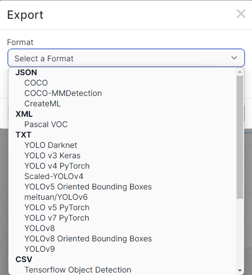

## Fine Tuning with Custom Dataset

1. Dataset Construction

    우선 학습을 진행할 dataset을 구축해야 한다. [roboflow](https://roboflow.com/) 라는 사이트에 접속한다. 10000장 이내의 사진을 사용할 때에는 무료로 사용 가능하다. 접속해서 로그인하면 아래와 같은 화면을 볼 수 있다.

    

    위의 사진에서 오른쪽에 빨간색으로 박스 친 부분을 눌러서 새로운 project를 생성한다. 자신이 진행할 project name과 annotation group 을 작성하고 Object Detection 을 선택하고 create 버튼을 눌러서 생성한다.

    

    Project name은 자신이 진행할 프로젝트의 이름이고 annotation group은 잘 모르겠으면 project name과 똑같이 설정해도 상관없이 진행할 수 있다.

    그러면 이제 아래와 같은 화면이 나타난다.

    

    왼쪽 Category에서 upload data에 자신이 진행할 프로젝트에 사용될 사진을 업로드하면 된다. 사진을 업로드하면 오른쪽 상단에 `Save and Continue` 라는 버튼이 나타나는데 이 버튼을 누르면 업로드가 완료된 것이다. 화면이 자동으로 넘어가며 우측에 아래와 같이 나타날 것이다.

    

    여기서 Start Manual Labeling을 누르고 다음 화면에서 Assign images 버튼을 누르면 이제 Labeling을 진행하기 위한 준비가 완료됐다. `Unannotated` 에 자신이 업로드한 사진이 존재할 것이다. 첫 번째 사진을 눌러서 첫 번째 사진부터 마지막 사진까지 Labeling을 진행하는 것이다.

2. Labeling

    **Labeling이란** : 이미지나 동영상에서 객체를 식별하고 분류하기 위해 관련 정보를 표시하는 과정이다. Roboflow에서 바운딩 박스로 라벨링하는 것을 통해 Computer Vision Model Training을 위해 특정 object 주위에 직사각형을 그려 객체의 위치와 크기를 정의하는 작업을 말한다. 이 과정을 통해서 데이터 세트를 구성하고 머신러닝 알고리즘이 각 객체를 올바르게 인식하고 분류할 수 있도록 하는 과정이다.

    1. Bounding Box로 Labeling을 진행할 때에는 항상 좌상단과 우하단이 기점이다. **1번** 의 마지막에서 labeling하기 위해서 사진을 클릭하면 마우스 포인터가 십자가 형식으로 바뀌어 있을 것이다. 따라서 bounding box로 지정할 object의 좌상단 혹은 우하단을 정해서 클릭하고 드래그해서 박스를 완성시킨다.

    2. 좌상단에 `Annotation Editor` 가 나타나면 여기에 bounding box로 표시한 object가 어떤 class로 classification하고 싶은지 class name을 작성한다.

        

    3. 이 방식으로 모든 dataset에 대해서 진행한다.

    4. 이렇게 진행하면 아래의 사진과 같이 `Unannotated` 옆에는 0이란 숫자가 나와야 하고, `Annotated` 옆에는 업로드한 dataset의 전체 갯수만큼 숫자가 나타날 것이다.

        
    
    5. 모든 dataset에 대해서 Labeling을 완료했으면, 위의 사진에서처럼 우측의 Add image to Dataset을 클릭한다.

        

        우측에 위와 같은 사진이 나타날 것이다. Train, Valid, Test 비율을 조정할 수 있다. 기본적으로 7:2:1의 비율을 추천한다. 그리고 `Add images` 버튼을 누른다.

    6. 이렇게 진행하면 Labeling 된 Dataset이 완성되었다. 

    7. 좌측의 Category에서 Dataset 옆에 숫자가 올라간 것이 보일 것이다. 그리고 Generate 버튼을 누르면, 아래와 같은 사진이 나타날 것이다.

        

        `Processing` 탭에서 Continue를 누르고 `Augmentation` 탭에서 `Add Augmentation Step` 을 눌러서 blur, noise brightness 등등의 여러가지 옵션들을 선택한다.

        

    8. 그리고 Create 창으로 넘어오면 이미지의 갯수를 늘릴 수 있다. 무료로 사용할 것이기 때문에 7번에서 설명한 Augmentation Options를 설정했다면, `3 images (3x)` 를 선택해서 진행하면 자신이 업로드한 dataset의 갯수보다 3배 많은 dataset을 최종적으로 얻을 수 있게 된다. 설정을 완료했으면 `Create` 버튼을 누른다.

    9. 좌측 탭에서 Versions라는 Category로 넘어오게 된다.

        

        여기서 우측 상단의 Export Dataset 버튼을 누른다.

        

        Format을 자신이 사용할 Model Architecture로 설정한다. 예제로 진행중인 Project는 YOLOv5 model을 사용하고 있으므로 `YOLO v5 PyTorch`를 선택하고 진행한다.

        `Show Download Code` 를 누르고 다음으로 진행한다.

        

        `Jupyter` 탭에 들어와서 링크를 전체 복사하고 `Done` 을 누른다.

3. Learning at Google Colab with Custom Dataset
    
    

    앞선 과정에서 진행했던 것과 같이 위의 사진처럼 코드를 셀에 입력하여 drive와 연동시킨다. 그리고 현재 위치를 MyDrive로 이동시킨다.

    그리고 roboflow에서 마지막에 `jupyter` 탭에서 복사한 코드 전체를 입력하고 실행한다.

    

    만약 경고 창이 나온다면 취소를 누른다. 실행이 완료되면 위의 사진처럼 실행하면 좌측에 해당 폴더가 생긴 것을 확인할 수 있다. 폴더 명은 자신이 설정한 project의 이름이므로 사람마다 다를 것이다.

    데이터셋의 다운로드가 완료된 다음 아래와 같이 데이터셋 안에 존재하는 `data.yaml` 파일을 yolov5 폴더 안으로 옮기고 `yolov5` 폴더로 이동한다.

    

    그리고 나서 yolov5 폴더 안에 `data.yaml` 파일을 이동했으므로, 이동된 파일을 더블클릭하면 우측에 해당 파일이 나타나게 된다. 그리고 오른쪽 열린 파일에서 `test`, `train`, `valid` 의 위치를 아래의 사진과 같이 `../${자신의 project name}/test/images` 와 같은 형태로 3가지 모두 수정해주면 된다.

    

    ```python
    !python train.py --weights '' --cfg models/yolov5m.yaml --data data.yaml --epochs 300 --batch-size 32 --name fine_tuning
    ```
    위의 코드를 통해 learning을 진행하면 자신이 직접 labeling한 dataset에 대해서 Object Detection이 가능한 weight 파일을 얻을 수 있다. `--name` 설정을 통해 원하는 폴더 이름으로 `runs/train/` 폴더 안에 저장시킬 수 있다.