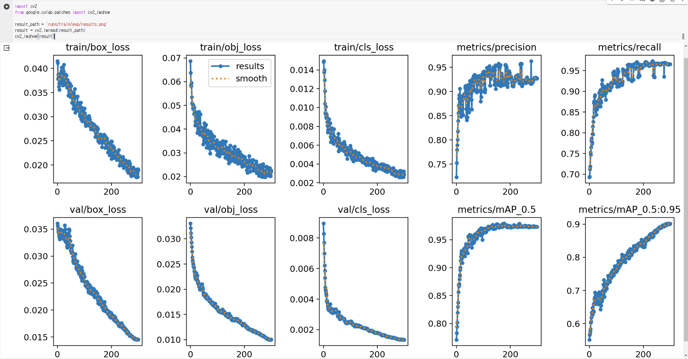

## Training

1. yolov5 folder download with git clone
    ```python
    from google.colab import drive
    drive.mount('/content/drive')
    %cd /content/drive/MyDrive
    ```
    ```
    !git clone https://github.com/ultralytics/yolov5
    ```
    
    
    위의 사진과 같이 *yolov5*가 *MyDrive* 폴더 안에 존재해야 한다.

    이렇게 되었을 때, `%cd yolov5` 를 입력해 현재 위치를 *yolov5* 폴더로 이동한다.

2. Training
    ```python
    !python train.py --weights yolov5m.pt --cfg models/yolov5m.yaml --data coco128.yaml --epochs 300 --batch-size 32
    ```
    `coco128` 이라는 dataset을 직접 학습을 진행한다.

    위와 같은 명령어를 통해 직접 학습을 진행해 볼 수 있다. `--weights` 뒤에 `''` 이와 같이 표시하면 pretrained model을 사용하지 않고 오로지 원하는 데이터 셋에 대해서 학습을 진행할 수 있다.
    
    해당 알고리즘을 개발한 사람이 공유한 weight파일을 pretrained model이라고 부르고, 기본적인 경우에는 이 pretrained model을 사용하는 것이 일반적으로 정확도가 더 높다.

    많은 양의 dataset을 사용하지 않는다면, 성능이 매우 떨어질 가능성이 크므로 이번에는 기존의 pretrained model인 `yolov5m.pt` 를 사용해서 이 학습결과에 추가적으로 학습을 진행시켜서 어떻게 학습을 시키는 것인지 방벙베 대해서 진행한다.

    

    위의 사진에 맨 아래에 epoch가 0부터 299까지 나오고 순차적으로 하나씩 증가하면서 진행되고 있으면 학습이 시작되었다는 것을 알 수 있다.

    
    
    위와 같이 `runs/train/exp` 위치에 저장되었다고 나타난다면 제대로 learning이 끝났다.

    ```python
    import cv2
    from google.colab.patches import cv2_imshow

    result_path = 'runs/train/exp/results.png'
    result = cv2.imread(result_path)
    cv2_imshow(result)
    ```
    
    
    위의 코드를 통해 위의 이미지와 같은 학습의 결과가 나오는 것을 확인할 수 있다.
    
3. Detection
    1. 기본적으로 Detection을 진행하기 위해 YOLOv5에서 제공하는 방식은 `detect.py` 를 사용하는 것이다. 이 방식은 아래와 같이 실행시켜볼 수 있다.
        ```python
        !python detect.py --weights runs/train/exp/weights/best.pt --source data/images/bus.jpg
        !python detect.py --weights runs/train/exp/weights/best.pt --source data/images/zidane.jpg
        ```

        

        위의 결과 사진을 보면, detect된 사진의 저장 위치가 나와있다. 해당 위치로 가서 사진을 확인해보면 된다.


    2. Ultralytics에서 제공하는 `detect.py` 를 이용해 Detection을 진행하기도 하지만 직접 파이썬 파일을 작성해 진행한다면 다양하게 이용해 볼 수 있다.
    ```python
    import torch
    import cv2
    from google.colab.patches import cv2_imshow

    model = torch.hub.load('./', 'custom', path='runs/train/exp/weights/best.pt', source='local', force_reload=True, trust_repo=True)
    img_zidane = cv2.imread('./data/images/zidane.jpg')
    img_bus = cv2.imread('./data/images/bus.jpg')

    yolo_1 = model(img_zidane)
    yolo_2 = model(img_bus)
    img_1 = yolo_1.render()[0]
    img_2 = yolo_2.render()[0]
    cv2_imshow(img_1)
    cv2_imshow(img_2)
    ```
    위와 같이 코드를 작성하면, 직접 학습시킨 weight파일로 제대로 detection이 되는지 확인해 볼 수 있다.

    추가적으로 해볼만한 프로젝트는 지금은 사진이 input인데 video를 input으로 해서 진행해 보는 것이다. 그리고 webcam을 통해 들어오는 실시간 카메라 이미지를 사용해서 진행해 보는 것이다. 하지만, webcam을 사용하는 방식은 colab이 아닌 local environment에서 실행해야 한다.
    